# TitanMfg™ Strategic Sourcing & Multi-Supplier Allocation Platform
> **Industrial Mixed-Integer Linear Programming (PuLP MILP) Sourcing Optimization, Multi-Plant MRP Netting, and Pre-PO Predictive Risk Suite**

[](https://www.python.org/)
[](https://github.com/coin-or/Cbc)
[](#system-architecture)
[-success.svg)](#automated-verification-suite)
[](#)

---

## 🏭 Executive Overview

**TitanMfg™ Strategic Sourcing Platform** is an enterprise-grade procurement optimization suite engineered for global industrial manufacturing. It solves the complex mathematical challenge of allocating raw material purchase orders across multiple certified global suppliers, 5 assembly manufacturing plants, and a 12-week time-phased planning horizon.

The platform eliminates spreadsheet silos by combining **exact mathematical optimization (PuLP MILP)**, **multi-echelon Bill of Materials (BOM) explosion**, **pre-PO machine learning delay prediction**, and **strict role-based access control (RBAC)** across 4 enterprise executive personas.

---

## ⚡ Key Capabilities


1. **Multi-Plant Demand Aggregation & MRP Netting**:
   - Time-phased Bill of Materials (BOM) explosion incorporating machining scrap (2% to 8%).
   - Dynamic inventory netting calculating **Inventory Coverage Ratios** `(On-Hand Stock / Safety Stock)` and **Weeks of Supply (WOS)**.
   - Interactive demand override grid with automatic downstream pipeline reconciliation.

2. **PuLP Mixed-Integer Linear Programming (MILP) Allocation Engine**:
   - Solves multi-objective linear programming models balancing unit purchase costs, multimodal freight rates, supplier risk penalties (λ_risk = 0.15), and order setup costs.
   - Enforces discrete **Minimum Order Quantities (MOQs)** `(x ≥ MOQ · y)`, weekly supplier capacity bounds, quality PPM ceilings (≤ 250 PPM), and anti-concentration volume bands (15% min to 60% max).
   - Exact lead-time backward PO release date scheduling:
     ```
     POReleaseWeek(s, m, p, t) = t - ceil((LeadTimeDays[s,m] + TransitDays[s,p]) / 7)
     ```

3. **Pre-PO Predictive Delivery Delay Radar**:
   - Machine learning logistic sigmoid regression predicting the probability of dock receipt delays exceeding 3 days `P(Delay > 3d)`.
   - Evaluates order-to-MOQ ratios, historical supplier delivery variance, and maritime/ground freight lane telemetry to assign `GREEN`, `AMBER`, or `RED` risk tiers with automated split-sourcing recommendations.

4. **Interactive Multi-Supplier Tuning Studio**:
   - Real-time volume sliders with live sub-MOQ violation alerts and dynamic risk/cost recalculation.

5. **Sub-Second What-If Disruption Scenario Simulator**:
   - Injects macroeconomic shocks in memory (e.g., complete supplier outages -100%, automotive demand spikes +45%, maritime shipping delays +3 weeks, quality PPM purges) and re-optimizes the entire schedule in `< 0.10 seconds`.

6. **5-Stage Strategic Sourcing Governance Cadence & Audit Trail**:
   - Formalized consensus workflow across Plant Materials, Sourcing, Quality Engineering, and Executive Leadership.
   - Immutable audit ledger generating **SHA-256 cryptographic hashes** for every ratified decision.

---

## 👥 Role-Based Access Control (RBAC) Workspaces

The application features a secure landing portal (`#login-screen`) with strict persona segmentation:

| Persona | Title & Functional Focus | Authorized Platform Views | Key Capabilities |
|---|---|---|---|
| **Robert Sterling** | Chief Procurement Officer (CPO) | • Executive Sourcing Cockpit<br>• What-If Disruption Simulator<br>• Governance & Ledger | Enterprise spend waterfalls, HHI concentration, strategic cost savings, CPO stage sign-off. |
| **Marcus Vance** | Global Category Sourcing Lead | • MILP Allocation Studio<br>• Pre-PO Delay Radar<br>• What-If Disruption Simulator<br>• Governance & Ledger | Volume share tuning sliders with live MOQ validation, split-sourcing contingency rebalancing. |
| **David Miller** | Plant Materials Operations Buyer | • Demand & MRP Netting<br>• Governance & Ledger | Gross demand netting, Weeks of Supply (WOS), time-phased demand overrides, **1-Click PO Release to EDI / SAP**. |
| **Dr. Aris Thorne** | Supplier Quality & Compliance Lead | • Supplier Scorecards & Quality Matrix<br>• Pre-PO Delay Radar<br>• Governance & Ledger | OTD % vs Defect PPM quadrant matrix, ISO-9001 compliance, quality ceiling audits. |

---

## 🏗️ System Architecture

```mermaid
flowchart TD
    subgraph CLIENT [Client Presentation Tier]
        UI1[Role-Based Authentication Portal: 4 Personas]
        UI2[Strict RBAC Navigation Drawer]
        UI3[Interactive Allocation Studio with Live MOQ Alerts]
        UI4[Pre-PO Predictive Delivery Delay Radar]
        UI5[Sub-Second What-If Disruption Simulator]
        UI6[1-Click Purchase Order Release Modal to EDI]
    end

    subgraph SERVER [Application & API Gateway Tier: Python 3.10+]
        S1[Multi-Threaded HTTP Server: ThreadedHTTPServer]
        S2[REST API Routing Gateway: 13 Endpoints]
        S3[Thread Mutex Lock Layer: threading.Lock]
        S4[Zero-Cache Security Headers & JSON Serialization]
    end

    subgraph ENGINES [Computational & Optimization Engine Tier]
        E1[Data Loader: Relational Loader & Capability Joiner]
        E2[MRP Engine: Time-Phased BOM Netting & WOS Coverage]
        E3[Scorecard Engine: Quality PPM & Risk Index R_s]
        E4[Sourcing Optimizer: PuLP MILP with CBC Solver]
        E5[Predictive Delay Engine: Machine Learning Logistic Sigmoid]
        E6[Spend Analytics: Landed Cost Waterfall & HHI Concentration]
        E7[Scenario Simulator: Disruption Re-Optimizer]
        E8[Governance Workflow: 5-Stage Cadence & SHA-256 Hashes]
    end

    subgraph DATA [Relational CSV Datasets]
        D1[Master Data: Materials, Suppliers, Plants, BOM Explosion]
        D2[Sourcing Terms: Pricing, Capacities, Scorecards, MOQs]
        D3[Demand & Logistics: Plant Demand, Safety Buffers, Freight Lanes]
        D4[Generated Artifacts: Sourcing Plan, Delay Alerts, Decisions]
    end

    CLIENT <-->|REST JSON Payloads| SERVER
    SERVER <-->|Vectorized In-Memory Slices| ENGINES
    ENGINES <-->|In-Memory Matrix Operations| DATA
```



---

## 📂 Project Structure

```
.
├── data/                               # 13 Relational Industrial Datasets
│   ├── master/                         # Material master (40 items), Supplier master (12), Plant master (5), BOMs
│   ├── suppliers/                      # Pricing grids, Capacity limits, Scorecards, MOQs
│   ├── demand/                         # 12-week plant demand, On-hand warehouse stock
│   ├── logistics/                      # Freight lane matrix (60 corridors)
│   └── outputs/                        # Solved allocation plan, Delay alerts, Audit ledger
├── docs/                               # Comprehensive Platform Specifications
│   ├── DATASET_SPECIFICATION.md        # Relational schemas, data dictionary, ERD diagram
│   ├── BUSINESS_FLOW_SPECIFICATION.md  # Mathematical models, MILP formulations, RACI matrix
│   ├── ARCHITECTURE_SPECIFICATION.md   # Technical architecture, module breakdown, REST APIs
│   └── GAP_ANALYSIS_AND_IMPROVEMENTS.md# In-scope gap audit & verification log
├── engine/                             # Core Python Computational Engines
│   ├── data_loader.py                  # Ingestion & capability matrix relational joiner
│   ├── mrp_engine.py                   # Multi-echelon BOM netting & inventory coverage
│   ├── supplier_scorecard_engine.py    # Quality PPM & composite risk calculation
│   ├── optimizer.py                    # PuLP MILP solver & backward scheduling
│   ├── predictive_delay_engine.py      # Logistic ML delay probability classifier
│   ├── spend_analytics_engine.py       # Landed cost waterfalls & HHI concentration
│   ├── scenario_simulator.py           # Real-time What-If disruption solver
│   ├── sourcing_workflow.py            # 5-stage cadence & SHA-256 cryptographic audit
│   └── orchestrator.py                 # Pipeline execution coordinator
├── scripts/
│   ├── generate_synthetic_data.py      # Industrial dataset generator & capability matrix builder
│   └── test_system_health.py           # 9-suite automated verification audit
├── server/
│   └── http_server.py                  # Multi-threaded zero-dependency REST API gateway
├── web/                                # Reactive ES6+ Frontend Client (Zero-Build)
│   ├── index.html                      # Semantic HTML5 single-page application
│   ├── style.css                       # Vanilla CSS3 glassmorphism design system
│   └── app.js                          # State store, RBAC routing, Chart.js integrations
├── Dockerfile                          # Production container specification
├── Procfile                            # Cloud deployment definition
├── requirements.txt                    # Python dependencies (pandas, pulp, numpy)
├── run_server.py                       # Local startup server daemon
└── README.md                           # Master repository documentation
```

---

## 🚀 Quickstart & Installation

### Option 1: Native Python Environment

```bash
# 1. Clone the repository
git clone https://github.com/<your-repo>/titanmfg-strategic-sourcing.git
cd titanmfg-strategic-sourcing

# 2. Install dependencies
pip install -r requirements.txt

# 3. Launch the platform server
python run_server.py
```
Open **`http://localhost:8000/`** in your browser.

---

### Option 2: Docker Container Deployment

```bash
# Build Docker image
docker build -t titanmfg-sourcing .

# Run container on port 8000
docker run -p 8000:8000 titanmfg-sourcing
```

---

## 🧪 Automated Verification Suite

Run the full automated system health audit:

```bash
python scripts/test_system_health.py
```

### Verification Results:
```
================================================================================
   STRATEGIC SOURCING PLATFORM: AUTOMATED SYSTEM VERIFICATION AUDIT
================================================================================
  [PASS] Test 1: Relational Dataset Integrity (40 Materials, 12 Suppliers, 5 Plants)
  [PASS] Test 2: MRP Netting Engine (Gross: 3,740,818, Net: 3,740,427)
  [PASS] Test 3: Supplier Scorecard & Composite Risk Classification
  [PASS] Test 4: PuLP MILP Optimization (Status: OPTIMAL, Fill: 100.0%, Cost: $352,683,668.06)
  [PASS] Test 5: Predictive Pre-PO Delay Engine (4,931 line-items evaluated)
  [PASS] Test 6: Spend Analytics & Concentration HHI (2223.1 - MODERATELY_CONCENTRATED)
  [PASS] Test 7: What-If Disruption Simulator (Cost Delta: -0.8%)
  [PASS] Test 8: 5-Stage Governance State Machine & Decision Ledger
  [PASS] Test 9: All 13 REST API Endpoints Verified (HTTP 200 OK)
--------------------------------------------------------------------------------
Audit Result: 9/9 Tests Passed (100% Pass Rate)
================================================================================
```

---

## 📚 Complete Platform Specifications

For full mathematical equations, data dictionaries, and architectural contracts, refer to the [`docs/`](./docs) folder:
- 📖 [**Dataset Specification & Data Dictionary**](./docs/DATASET_SPECIFICATION.md)
- 📐 [**Business Flow Specification & Mathematical Models**](./docs/BUSINESS_FLOW_SPECIFICATION.md)
- 🏛️ [**Technical Architecture & REST API Specification**](./docs/ARCHITECTURE_SPECIFICATION.md)
- 🔍 [**In-Scope Gap Analysis & Resolution Log**](./docs/GAP_ANALYSIS_AND_IMPROVEMENTS.md)
