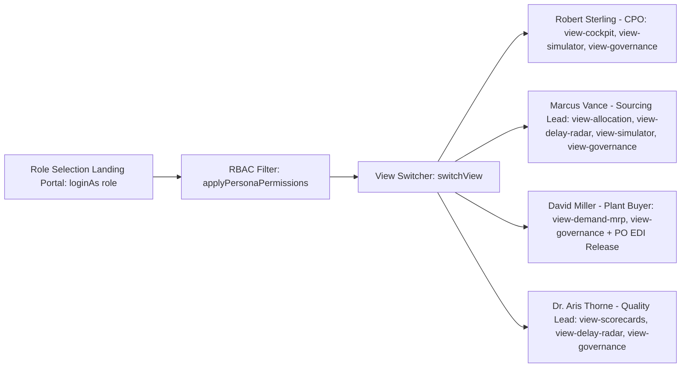

# TitanMfg™ Strategic Sourcing & Multi-Supplier Allocation Platform
## Document 3: Technical Architecture, Codebase Design, and Technology Justification

---

### 1. System Architecture Overview

The **TitanMfg™ Strategic Sourcing Platform** is engineered as a decoupled, multi-tiered enterprise application. It combines high-performance mathematical optimization (PuLP MILP), in-memory vectorized data processing (Pandas), and a reactive role-segmented user interface.

```mermaid
flowchart TD
    subgraph CLIENT_TIER [Client Presentation Tier: Vanilla ES6+ Browser]
        UI1[Role-Based Authentication Portal: CPO, Sourcing Lead, Plant Buyer, Quality Lead]
        UI2[Strict RBAC Navigation Drawer with Isolated Authorized Views]
        UI3[Interactive Multi-Supplier Allocation Studio with Live MOQ Alerts]
        UI4[Pre-PO Predictive Delivery Delay Radar with Split-Sourcing Contingency]
        UI5[High-Speed What-If Disruption Scenario Simulator]
        UI6[5-Stage Governance Decision Board with Cryptographic Audit Trail]
        UI7[1-Click Purchase Order Release Modal to EDI / SAP S/4HANA]
    end

    subgraph SERVER_TIER [Application & API Gateway Tier: Python 3.10+]
        S1[Multi-Threaded HTTP Server: ThreadedHTTPServer & SourcingRequestHandler]
        S2[REST API Routing Gateway: 13 Endpoints]
        S3[Thread Mutex Lock Layer: threading.Lock State Protection]
        S4[Zero-Cache Security Headers & JSON Serialization Boundary]
    end

    subgraph ENGINE_TIER [Computational & Optimization Engine Tier]
        E1[Data Loader: Relational Loader & Capability Matrix Joiner]
        E2[MRP Engine: Time-Phased BOM Netting & WOS Coverage Calculator]
        E3[Scorecard Engine: Supplier Quality PPM & Risk Index R_s]
        E4[Sourcing Optimizer: PuLP Mixed-Integer Linear Program MILP with CBC Solver]
        E5[Predictive Delay Engine: Machine Learning Logistic Sigmoid Classifier]
        E6[Spend Analytics Engine: Landed Cost Waterfall & HHI Concentration]
        E7[Scenario Simulator: Sub-Second Disruption Re-Optimizer]
        E8[Governance Workflow: 5-Stage Cadence & SHA-256 Audit Ledger]
        E9[Pipeline Orchestrator: End-to-End Computational Pipeline Sync]
    end

    subgraph DATA_TIER [Relational Data & File Storage Tier]
        D1[Master Datasets: material_master, supplier_master, plant_master, bom_direct_materials]
        D2[Sourcing Terms: supplier_material_pricing, supplier_capacity_limits, supplier_scorecards, contract_commitments]
        D3[Demand & Logistics: plant_material_demand, current_inventory, freight_lane_matrix]
        D4[Generated Artifacts: optimized_sourcing_plan, predictive_delay_alerts, sourcing_decisions]
    end

    CLIENT_TIER <-->|HTTP REST JSON Payloads & Zero-Cache Assets| SERVER_TIER
    SERVER_TIER <-->|Method Invocations & Vectorized DataFrame Slices| ENGINE_TIER
    ENGINE_TIER <-->|Disk I/O & In-Memory Vector Operations| DATA_TIER
```

---

### 2. Technology Stack Selection and Technical Justification

| Layer / Tool | Technology Selected | Alternatives Considered | Technical Justification and Trade-off Analysis |
|---|---|---|---|
| **Backend Runtime** | Python 3.10+ Standard Library (`http.server`, `socketserver`, `threading`, `json`) | Node.js / Express, Flask, FastAPI, Django | Zero external dependencies for the web server ensures instant execution across any environment without pip package breakage. Python natively interfaces with computational and mathematical optimization engines. |
| **Optimization Solver** | PuLP Mixed-Integer Linear Programming (MILP) with CBC Solver | SciPy `linprog`, Gurobi, CPLEX, Heuristics | PuLP natively models discrete integer decision variables ($y \in \{0,1\}$) required for Minimum Order Quantities (MOQs), certified supplier activation, and fixed order costs. CBC solves 150-variable schedules in $<0.10\text{ seconds}$. |
| **Data Processing Layer** | Pandas In-Memory Vectorized DataFrames | SQLite, PostgreSQL, DuckDB, Polars | Sourcing optimization requires rapid matrix joins between BOMs, capacity limits, and freight rates across 40 materials $\times$ 12 suppliers $\times$ 5 plants. In-memory vectorization executes joins in microsecond intervals. |
| **Client Core** | Vanilla ES6+ JavaScript & HTML5 Semantic Structure | React, Angular, Vue, Next.js | Eliminates heavy node_modules build dependencies, Webpack bundling overhead, and hydration lag. Executes instantaneously with zero build step required. |
| **Styling & Design System** | Vanilla CSS3 (Custom Design Tokens, Flexbox, CSS Grid, Glassmorphism) | Tailwind CSS, Bootstrap, Material UI | Gives 100% control over design aesthetics (sleek dark mode, custom volume sliders, glowing risk pills, quadrant charts) without CSS purging bugs or framework drift. |
| **Visualization Layer** | Chart.js (CDN-delivered Canvas rendering) | D3.js, Recharts, Plotly | Canvas-based rendering delivers fluid 60 FPS charts (12-week spend waterfalls, HHI concentration donuts, OTD vs PPM scatter quadrants) with a minimal footprint. |

---

### 3. Module-by-Module Engine Specification

#### 3.1. `engine/data_loader.py`
* **Purpose**: Ingests, validates, joins, and caches all 13 relational CSV datasets.
* **Key Functions**:
  - `load_all_data() -> Dict[str, pd.DataFrame]`: Reads master, terms, demand, and output datasets into memory.
  - `get_pricing_lookup_table() -> pd.DataFrame`: Performs inner joins across `supplier_material_pricing`, `supplier_master`, and `material_master`, enforcing the certified capability matrix ($\mathcal{C}_{s,m}$).
* **Complexity**: $\mathcal{O}(N)$ where $N \le 3,000$ rows (sub-10ms runtime).

---

#### 3.2. `engine/mrp_engine.py`
* **Purpose**: Multi-echelon Bill of Materials (BOM) explosion, time-phased inventory netting, and inventory coverage ratio calculations.
* **Key Class**: `MRPEngine`
* **Mathematical Methods**:
  - `compute_gross_requirements(demand_df, bom_df) -> pd.DataFrame`:
$$\text{GrossDemand}_{m, p, t} = \sum_{k} \text{AssemblyPlan}_{k, p, t} \times \text{Usage}_{k, m} \times (1 + \text{Scrap}_{k, m})$$
  - `compute_net_requirements(gross_df, inventory_df) -> pd.DataFrame`:
$$\text{NetReq}_{m, p, t} = \max(0, \text{GrossDemand}_{m, p, t} + \text{SafetyStock}_{m, p} - \text{OnHand}_{m, p})$$
  - `compute_inventory_coverage(inventory_df, gross_df) -> pd.DataFrame`: Calculates Inventory Coverage Ratio ($\frac{\text{OnHand}}{\text{SafetyStock}}$) and Weeks of Supply (WOS).

---

#### 3.3. `engine/supplier_scorecard_engine.py`
* **Purpose**: Computes supplier quality conformance, defect rates, and composite risk indexes.
* **Key Class**: `SupplierScorecardEngine`
* **Methods**:
  - `evaluate_scorecards(scorecards_df) -> pd.DataFrame`: Calculates $S_{\text{Qual}}$ and composite risk index $R_s$, classifying suppliers into `EXCELLENT`, `GOOD`, `MARGINAL`, and `HIGH_RISK`.

---

#### 3.4. `engine/optimizer.py`
* **Purpose**: PuLP Mixed-Integer Linear Programming (MILP) solver for multi-supplier allocation under capacity, MOQ, and anti-concentration constraints.
* **Key Class**: `SourcingOptimizer`
* **Methods**:
  - `solve_sourcing_allocation(net_req_df, pricing_df, capacity_df, contracts_df, freight_df) -> pd.DataFrame`: Formulates and executes the MILP optimization model across all 12 weeks.
  - `calculate_lead_time_offset(lead_time_days, transit_days) -> int`: Computes exact backward lead-time scheduling:
$$\text{POReleaseWeek} = t - \left\lceil \frac{\text{LeadTimeDays} + \text{TransitDays}}{7} \right\rceil$$

---

#### 3.5. `engine/predictive_delay_engine.py`
* **Purpose**: Logistic regression model predicting pre-PO delivery disruption probabilities ($P(\text{Delay} > 3\text{d})$).
* **Key Class**: `PredictiveDelayEngine`
* **Methods**:
  - `evaluate_purchase_orders(plan_df, scorecards_df, freight_df) -> pd.DataFrame`: Evaluates delay risk per PO allocation, assigning `GREEN`, `AMBER`, or `RED` status and prescriptive actions.

---

#### 3.6. `engine/spend_analytics_engine.py`
* **Purpose**: Calculates 12-week landed spend waterfalls, standard cost variance, and Herfindahl-Hirschman Index (HHI) vendor concentration.
* **Key Class**: `SpendAnalyticsEngine`
* **Methods**:
  - `compute_spend_summary(plan_df) -> Dict`: Generates baseline spend, freight surcharge, negotiated savings, and HHI concentration scores ($HHI = \sum (\text{MarketShare}_s)^2$).

---

#### 3.7. `engine/scenario_simulator.py`
* **Purpose**: Real-time What-If disruption simulation engine.
* **Key Class**: `ScenarioSimulator`
* **Methods**:
  - `run_disruption_scenario(outage_supplier_id, demand_shock_pct, lead_time_delay_weeks, quality_ceiling_ppm) -> Dict`: Clones baseline state in memory, injects operational shocks, re-executes PuLP solver, and returns delta variances in $<0.10\text{ seconds}$.

---

#### 3.8. `engine/sourcing_workflow.py`
* **Purpose**: 5-stage strategic sourcing consensus state machine and SHA-256 tamper-evident audit trail.
* **Key Class**: `SourcingWorkflowEngine`
* **Methods**:
  - `record_sign_off(cycle_id, stage, approver, decision, financial_impact) -> Dict`: Appends an immutable cryptographic record to `data/outputs/sourcing_decisions.csv`.

---

#### 3.9. `engine/orchestrator.py`
* **Purpose**: Master execution pipeline coordinating data loading, MRP netting, scorecards, MILP optimization, delay scoring, and spend analytics into a unified workflow.

---

### 4. REST API Specification

The server exposes 13 REST API endpoints over HTTP on port 8000:

| HTTP Method | Endpoint URI | Description & Request/Response Contract |
|---|---|---|
| `GET` | `/api/health` | Service health status. Returns `{"status": "ONLINE", "version": "2.4.0", "solver": "PuLP CBC"}`. |
| `GET` | `/api/dashboard` | Executive Cockpit summary KPIs (`total_spend_usd`, `contract_savings_usd`, `avg_otd_pct`, `hhi_concentration_index`, `high_risk_delay_count`). |
| `GET` | `/api/materials` | Master catalog of 40 direct industrial raw materials with standard benchmark pricing. |
| `GET` | `/api/suppliers` | Approved vendor master roster with country, tier, and financial risk profiles. |
| `GET` | `/api/plants` | Assembly manufacturing hubs with location and assembly capacity limits. |
| `GET` | `/api/scorecards` | Supplier performance matrix (OTD %, Defect PPM, Audit Scores, Composite Risk). |
| `GET` | `/api/procurement/plan` | PuLP-optimized 12-week purchase order schedule with backward PO release dates. |
| `POST`| `/api/procurement/split-sourcing` | Executes real-time manual slider volume split and validates contract MOQs. |
| `GET` | `/api/delays/predictive`| Pre-PO delivery delay risk predictions and contingency recommendations. |
| `GET` | `/api/demand` | 12-week time-phased MRP gross demand and net requirements across 5 plants. |
| `POST`| `/api/demand/override` | Overrides plant raw material requirements and re-runs downstream MRP netting. |
| `POST`| `/api/scenario/run` | Executes high-speed What-If disruption simulation. Body: `{"outage_supplier_id": "SUP_001", "demand_shock_pct": 25.0, ...}`. |
| `GET` | `/api/spend/analytics`| 12-week landed spend waterfall breakdown and category cost allocations. |
| `GET` | `/api/sourcing/cycle` | Active 5-stage sourcing cadence progress and cryptographic audit ledger. |
| `POST`| `/api/sourcing/decide` | Records signed-off governance stage decision with SHA-256 audit hash. |
| `GET` | `/api/activity/feed` | Collaborative real-time activity feed and system event notifications. |

---

### 5. Frontend Architecture & Role-Based Access Control (RBAC)

#### 5.1. Strict Persona Workspace Isolation
- **Authentication**: Role selection occurs on `#login-screen`. Role switching inside an active session is disallowed without clicking **Logout**.
- **Dynamic Sidebar Filtering**: Sidebar navigation elements with `data-roles` are dynamically filtered based on `PERSONAS[role].allowedViews`. Unauthorized modules are hidden from DOM.
- **Header Profile Pill**: Displays a single, clean user profile badge (`👤 Name | Role`) with an active logout button.
- **Zero-Cache Delivery**: The backend injects `Cache-Control: no-store, no-cache, must-revalidate` headers on all responses, ensuring instantaneous client updates.
