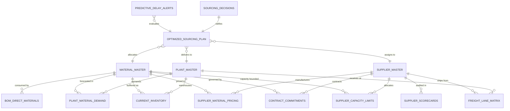

# TitanMfg™ Strategic Sourcing & Multi-Supplier Allocation Platform
## Document 1: Relational Dataset Specification, Data Dictionary, and Schema Architecture

---

### 1. Domain Context and Data Modeling Rationale

The **TitanMfg™ Strategic Sourcing Platform** models direct industrial raw material procurement for global manufacturing assembly plants. Operating across heavy industrial manufacturing, the supply ecosystem is characterized by:

- **12-Week Time-Phased Planning Horizon**: Synchronized across fiscal quarters to align with Master Production Schedules (MPS) and multi-plant Material Requirements Planning (MRP).
- **Direct Industrial Raw Material Specialization**: 40 direct industrial raw materials spanning 8 engineering categories (*Structural Steel, Aluminum Alloys, Polymers & Resins, Electronic Subassemblies, Precision Bearings, Hydraulics, High-Tensile Fasteners, Industrial Composites*).
- **Certified Supplier-Material Capability Matrices `(C[s, m])`**: In industrial manufacturing, suppliers possess specialized tooling, machinery, and metallurgical certifications. *Not every supplier can supply every material category*. Only certified supplier-material pairs receive procurement allocations.
- **Multi-Facility Operating Footprint**:
  - **40 Direct Raw Materials** with safety stock buffers and standard accounting benchmarks ($5.00 to $450.00 USD).
  - **12 Approved Global Suppliers** located in Germany, USA, Japan, South Korea, Mexico, Vietnam, India, and Taiwan.
  - **5 Manufacturing Assembly Hubs** located in Detroit, Munich, Monterrey, Tokyo, and Chennai.
  - **30 Finished Industrial SKU Assemblies** with detailed Bill of Materials (BOM) explosion mappings.
  - **60 International & Domestic Freight Lanes** capturing transit days, shipping rates, and lane reliability telemetry.

The datasets are structured into 13 relational CSV schemas designed to eliminate spreadsheet silos and support deterministic Mixed-Integer Linear Programming (MILP), time-phased inventory netting, pre-PO delay modeling, and cross-functional governance.

---

### 2. Entity-Relationship Diagram (ERD)

---

### 3. Comprehensive Dataset Specifications

#### 3.1. Master Data Layer (`data/master/`)

##### 3.1.1. `data/master/material_master.csv`
* **Purpose**: Master catalog of direct industrial raw materials, commodities, and subassemblies.
* **Cardinality**: 40 tuples (40 unique materials across 8 categories).
* **Primary Key**: `material_id`

| Attribute | Data Type | Unit / Format | Domain / Range | Description and Business Representation |
|---|---|---|---|---|
| `material_id` | String | `MAT_XXX` | `MAT_001` to `MAT_040` | Unique alphanumeric identifier for direct raw material. |
| `material_name` | String | Text | E.g., "High-Tensile Structural Steel I-Beam" | Commercial and engineering nomenclature. |
| `category` | String | Categorical | *Structural Steel, Aluminum Alloys, Polymers & Resins, Electronic Subassemblies, Precision Bearings, Hydraulics, High-Tensile Fasteners, Industrial Composites* | Industrial material classification. |
| `unit_of_measure` | String | Categorical | `kg`, `meters`, `units` | Standard physical engineering unit of measurement. |
| `standard_cost_usd` | Decimal | USD ($/unit) | 1.20 to 450.00 | Standard financial baseline benchmark cost. |
| `criticality` | String | Categorical | `HIGH`, `MEDIUM`, `LOW` | Operational criticality index based on assembly vulnerability. |

---

##### 3.1.2. `data/master/supplier_master.csv`
* **Purpose**: Profiles certified Tier-1 and Tier-2 global suppliers and baseline financial risk scores.
* **Cardinality**: 12 tuples (`SUP_001` to `SUP_012`).
* **Primary Key**: `supplier_id`

| Attribute | Data Type | Unit / Format | Domain / Range | Description and Business Representation |
|---|---|---|---|---|
| `supplier_id` | String | `SUP_XXX` | `SUP_001` to `SUP_012` | Unique approved vendor identifier. |
| `supplier_name` | String | Text | E.g., "Apex Precision Metals GmbH" | Registered corporate entity name. |
| `country` | String | Text | Germany, USA, Japan, South Korea, Mexico, Vietnam, India, Taiwan | Geographic headquarters / manufacturing center. |
| `tier` | String | Categorical | `Tier-1`, `Tier-2` | Supply chain echelon tier. |
| `base_financial_risk_score` | Decimal | Index (1.0–5.0) | 1.1 to 3.4 | Dun & Bradstreet aligned liquidity and geopolitical risk score. |
| `iso_certified` | Boolean | Boolean | `TRUE`, `FALSE` | ISO-9001 quality management certification status. |

---

##### 3.1.3. `data/master/plant_master.csv`
* **Purpose**: Defines assembly manufacturing facilities, locations, and capacity thresholds.
* **Cardinality**: 5 tuples (`PLANT_01` to `PLANT_05`).
* **Primary Key**: `plant_id`

| Attribute | Data Type | Unit / Format | Domain / Range | Description and Business Representation |
|---|---|---|---|---|
| `plant_id` | String | `PLANT_XX` | `PLANT_01` to `PLANT_05` | Manufacturing hub identifier. |
| `plant_name` | String | Text | E.g., "Detroit Advanced Assembly Hub" | Manufacturing facility name. |
| `location` | String | Text | Detroit, Munich, Monterrey, Tokyo, Chennai | Operational hub city. |
| `weekly_assembly_capacity_units` | Integer | Units | 10,000 to 20,000 | Baseline finished assembly production capacity. |

---

##### 3.1.4. `data/master/bom_direct_materials.csv`
* **Purpose**: Bill of Materials (BOM) recipe exploding finished SKUs into raw material requirements.
* **Cardinality**: 120 tuples (30 finished industrial SKUs $\times$ 4 direct materials each).
* **Primary Key**: Composite (`sku_id`, `material_id`)
* **Foreign Keys**: `material_id` $\rightarrow$ `material_master.material_id`

| Attribute | Data Type | Unit / Format | Domain / Range | Description and Business Representation |
|---|---|---|---|---|
| `sku_id` | String | `SKU_XXX` | `SKU_001` to `SKU_030` | Finished industrial assembly reference. |
| `material_id` | String | `MAT_XXX` | `MAT_001` to `MAT_040` | Direct raw material component reference. |
| `usage_qty_per_unit` | Decimal | Units / Assembly | 1.20 to 8.50 | Net material consumption per finished SKU. |
| `scrap_allowance_pct` | Decimal | Percentage (0.0–1.0) | 0.02 to 0.08 | Industrial machining scrap / cutting waste factor (2%–8%). |

---

#### 3.2. Sourcing Terms & Performance Layer (`data/suppliers/`)

##### 3.2.1. `data/suppliers/supplier_material_pricing.csv`
* **Purpose**: Contracted pricing terms, Minimum Order Quantities (MOQs), and standard lead times for certified supplier-material pairs.
* **Cardinality**: 135 tuples (certified capability matrix: each supplier is certified for 8–12 specific materials).
* **Primary Key**: Composite (`supplier_id`, `material_id`)
* **Foreign Keys**: `supplier_id` $\rightarrow$ `supplier_master.supplier_id`, `material_id` $\rightarrow$ `material_master.material_id`

| Attribute | Data Type | Unit / Format | Domain / Range | Description and Business Representation |
|---|---|---|---|---|
| `supplier_id` | String | `SUP_XXX` | Valid `supplier_id` | Vendor reference. |
| `material_id` | String | `MAT_XXX` | Valid `material_id` | Certified material reference. |
| `unit_price_usd` | Decimal | USD ($/unit) | 1.15 to 465.00 | Contract purchase price per material unit. |
| `moq_units` | Integer | Units / Batch | 250 to 1,200 | Contract Minimum Order Quantity batch threshold. |
| `standard_lead_time_weeks` | Integer | Weeks | 2 to 6 | Order confirmation to factory gate dispatch lead time. |

---

##### 3.2.2. `data/suppliers/contract_commitments.csv`
* **Purpose**: Defines legal allocation share bands (anti-concentration minimum floors and maximum allocation caps).
* **Cardinality**: 135 tuples.
* **Primary Key**: Composite (`supplier_id`, `material_id`)

| Attribute | Data Type | Unit / Format | Domain / Range | Description and Business Representation |
|---|---|---|---|---|
| `supplier_id` | String | `SUP_XXX` | Valid `supplier_id` | Vendor reference. |
| `material_id` | String | `MAT_XXX` | Valid `material_id` | Material reference. |
| `min_guaranteed_share_pct` | Decimal | Percentage (0.0–1.0) | 0.10 to 0.20 | Contractual secondary sourcing volume floor (10%–20%). |
| `max_allocation_cap_pct` | Decimal | Percentage (0.0–1.0) | 0.55 to 0.70 | Anti-concentration primary supplier cap (55%–70%). |

---

##### 3.2.3. `data/suppliers/supplier_capacity_limits.csv`
* **Purpose**: Time-phased maximum weekly production capacity per certified supplier-material pair across 12 weeks.
* **Cardinality**: 1,620 tuples (135 certified pairs $\times$ 12 weeks).
* **Primary Key**: Composite (`supplier_id`, `material_id`, `period_week`)

| Attribute | Data Type | Unit / Format | Domain / Range | Description and Business Representation |
|---|---|---|---|---|
| `supplier_id` | String | `SUP_XXX` | Valid `supplier_id` | Vendor reference. |
| `material_id` | String | `MAT_XXX` | Valid `material_id` | Material reference. |
| `period_week` | String | `WXX` | `W01` to `W12` | Planning fiscal week. |
| `max_weekly_capacity_units` | Integer | Units | 4,600 to 15,100 | Maximum weekly production capacity allocated to TitanMfg. |

---

##### 3.2.4. `data/suppliers/supplier_scorecards.csv`
* **Purpose**: Historical supplier performance telemetry, delivery reliability, defect PPM, and composite risk classification.
* **Cardinality**: 12 tuples (`SUP_001` to `SUP_012`).
* **Primary Key**: `supplier_id`

| Attribute | Data Type | Unit / Format | Domain / Range | Description and Business Representation |
|---|---|---|---|---|
| `supplier_id` | String | `SUP_XXX` | `SUP_001` to `SUP_012` | Vendor identifier. |
| `historical_otd_pct` | Decimal | Percentage (0–100%) | 79.5% to 98.2% | Observed historical On-Time Delivery (OTD) percentage. |
| `defect_ppm` | Integer | Parts Per Million | 45 to 820 PPM | Historical incoming parts defect rate. |
| `quality_audit_score` | Integer | Score (1–100) | 62 to 98 | Annual plant quality engineering audit score. |
| `lead_time_variance_days` | Decimal | Days (StdDev) | 0.6 to 6.1 days | Standard deviation in manufacturing/shipping duration. |
| `reliability_rating` | String | Categorical | `EXCELLENT`, `GOOD`, `MARGINAL`, `HIGH_RISK` | Composite classification category. |

---

#### 3.3. Demand & Logistics Layer (`data/demand/` & `data/logistics/`)

##### 3.3.1. `data/demand/plant_material_demand.csv`
* **Purpose**: Weekly gross forecasted raw material demand across 5 assembly plants over 12 weeks.
* **Cardinality**: 2,400 tuples (40 materials $\times$ 5 plants $\times$ 12 weeks).
* **Primary Key**: Composite (`material_id`, `plant_id`, `period_week`)

| Attribute | Data Type | Unit / Format | Domain / Range | Description and Business Representation |
|---|---|---|---|---|
| `material_id` | String | `MAT_XXX` | `MAT_001` to `MAT_040` | Direct raw material reference. |
| `plant_id` | String | `PLANT_XX` | `PLANT_01` to `PLANT_05` | Destination assembly facility. |
| `period_week` | String | `WXX` | `W01` to `W12` | Planning delivery period week. |
| `forecasted_demand_units` | Integer | Units | 550 to 2,650 | Time-phased gross production requirement. |

---

##### 3.3.2. `data/demand/current_inventory.csv`
* **Purpose**: On-hand warehouse stock balances and safety stock buffers maintained at each plant.
* **Cardinality**: 200 tuples (40 materials $\times$ 5 plants).
* **Primary Key**: Composite (`material_id`, `plant_id`)

| Attribute | Data Type | Unit / Format | Domain / Range | Description and Business Representation |
|---|---|---|---|---|
| `material_id` | String | `MAT_XXX` | Valid `material_id` | Material reference. |
| `plant_id` | String | `PLANT_XX` | Valid `plant_id` | Plant location reference. |
| `available_on_hand_units` | Integer | Units | 210 to 1,300 | Unrestricted physical stock on warehouse floor. |
| `safety_stock_threshold_units` | Integer | Units | 300 to 1,000 | Minimum required buffer stock. |

---

##### 3.3.3. `data/logistics/freight_lane_matrix.csv`
* **Purpose**: Transportation lanes, maritime/ground transit times, unit freight costs, and lane reliability ratings.
* **Cardinality**: 60 tuples (12 suppliers $\times$ 5 plants).
* **Primary Key**: Composite (`supplier_id`, `plant_id`)

| Attribute | Data Type | Unit / Format | Domain / Range | Description and Business Representation |
|---|---|---|---|---|
| `supplier_id` | String | `SUP_XXX` | Valid `supplier_id` | Origin supplier facility. |
| `plant_id` | String | `PLANT_XX` | Valid `plant_id` | Destination assembly plant. |
| `transit_time_days` | Integer | Days | 1 to 24 days | Inter-facility logistics transit duration. |
| `freight_cost_per_unit_usd` | Decimal | USD ($/unit) | 0.45 to 7.70 | Landed logistics and freight handling cost per unit. |
| `lane_reliability_pct` | Decimal | Percentage (0–100%) | 86.0% to 99.5% | Historical carrier On-Time In-Full (OTIF) reliability. |

---

#### 3.4. Optimization Output Layer (`data/outputs/`)

##### 3.4.1. `data/outputs/optimized_sourcing_plan.csv`
* **Purpose**: Solved optimal purchase order allocation matrix produced by PuLP MILP solver.
* **Cardinality**: Dynamic (~3,500–5,000 solved allocation lines).
* **Primary Key**: Composite (`material_id`, `supplier_id`, `plant_id`, `period_week`)

| Attribute | Data Type | Unit / Format | Description and Business Representation |
|---|---|---|---|
| `material_id` | String | `MAT_XXX` | Direct raw material item reference. |
| `material_name` | String | Text | Material commercial trade name. |
| `supplier_id` | String | `SUP_XXX` | Allocated vendor identifier. |
| `supplier_name` | String | Text | Allocated vendor corporate name. |
| `plant_id` | String | `PLANT_XX` | Destination manufacturing hub. |
| `plant_name` | String | Text | Destination manufacturing hub name. |
| `period_week` | String | `WXX` | Target delivery schedule week. |
| `allocated_units` | Integer | Units | Solved procurement order quantity. |
| `unit_price_usd` | Decimal | USD ($) | Base contract purchase price. |
| `freight_cost_per_unit_usd` | Decimal | USD ($) | Landed freight cost per unit. |
| `landed_cost_usd` | Decimal | USD ($) | Total landed expenditure: `(unit_price + freight) * units`. |
| `standard_cost_usd` | Decimal | USD ($) | Baseline benchmark expenditure standard. |
| `po_release_week` | String | `WXX` | Lead-time backward scheduled PO release week. |
| `expected_delivery_week` | String | `WXX` | Scheduled dock receipt week. |
| `lead_time_weeks` | Integer | Weeks | Total lead time offset: `ceil((LeadTimeDays + TransitDays) / 7)`. |
| `moq_compliance_status` | String | Categorical | `COMPLIANT`, `SUB_MOQ_VIOLATION` indicator. |

---

##### 3.4.2. `data/outputs/predictive_delay_alerts.csv`
* **Purpose**: Pre-PO delivery delay risk predictions, logistic delay probabilities, and recommended actions.
* **Cardinality**: Dynamic (Evaluated per solved purchase order line).
* **Primary Key**: Composite (`material_id`, `supplier_id`, `plant_id`, `period_week`)

| Attribute | Data Type | Domain / Range | Description and Business Representation |
|---|---|---|---|
| `po_id` | String | `PO-MAT-SUP-PLT-WXX` | Synthetic purchase order tracking identifier. |
| `supplier_id` | String | Valid `supplier_id` | Assigned supplier. |
| `material_id` | String | Valid `material_id` | Procured material. |
| `plant_id` | String | Valid `plant_id` | Receiving manufacturing facility. |
| `period_week` | String | `W01` to `W12` | Delivery period week. |
| `allocated_units` | Integer | Units | Order quantity. |
| `delay_probability_pct` | Decimal | 0.0% to 100.0% | Logistic probability of delivery delay $> 3\text{ days}$. |
| `risk_tier` | String | `GREEN`, `AMBER`, `RED` | Risk classification tier. |
| `status_label` | String | Text | Descriptive risk severity statement. |
| `recommended_action` | String | Text | Prescriptive mitigation (Direct Dispatch, Buffer Transit, Split-Source). |

---

##### 3.4.3. `data/outputs/sourcing_decisions.csv`
* **Purpose**: Immutable governance audit ledger logging cross-functional approvals and SHA-256 cryptographic hashes.
* **Cardinality**: Dynamic (Appended upon each formal stage sign-off).
* **Primary Key**: Composite (`cycle_id`, `stage`)

| Attribute | Data Type | Domain / Range | Description and Business Representation |
|---|---|---|---|
| `audit_hash` | String | SHA-256 (16-char) | Cryptographic tamper-evident hash checksum. |
| `cycle_id` | String | `CYC-YYYY-QXX` | Fiscal sourcing cadence code. |
| `stage` | String | `STAGE_1` to `STAGE_5` | Sourcing governance stage. |
| `owner_role` | String | Text | Executive, Sourcing Lead, Plant Buyer, Quality Lead. |
| `decision` | String | Text | Formal decision record and justification. |
| `financial_impact` | Decimal | USD ($) | Reconciled P&L variance impact. |
| `risk_impact` | Decimal | Delta | Composite risk index variance. |
| `status` | String | `APPROVED`, `PENDING` | Governance approval status. |
| `approved_by` | String | Text | Signing authority identity. |
| `timestamp` | Timestamp | ISO 8601 | Tamper-evident execution timestamp. |

---

### 4. Summary of Relational Schema Volume

| Layer | Datasets | Total Tuples (Rows) | Total Attributes (Cols) | Primary Functional Scope |
|---|---|---|---|---|
| **Master Data Layer** | 4 Datasets | 177 Rows | 21 Columns | Materials, Suppliers, Plants, BOM Explosion |
| **Sourcing Terms & Scorecards** | 4 Datasets | 1,902 Rows | 17 Columns | Pricing, MOQs, Capacity Limits, Scorecard Audits |
| **Demand & Logistics Layer** | 3 Datasets | 2,660 Rows | 14 Columns | Multi-Plant Demand, Safety Buffers, Freight Lanes |
| **Optimization Output Layer** | 3 Datasets | Dynamic (~5,000) | 33 Columns | Solved Sourcing Plan, Delay Radar, Audit Ledger |
| **Platform Total** | **14 Datasets** | **~9,739 Rows** | **85 Columns** | **Deterministic End-to-End Procurement Engine** |
